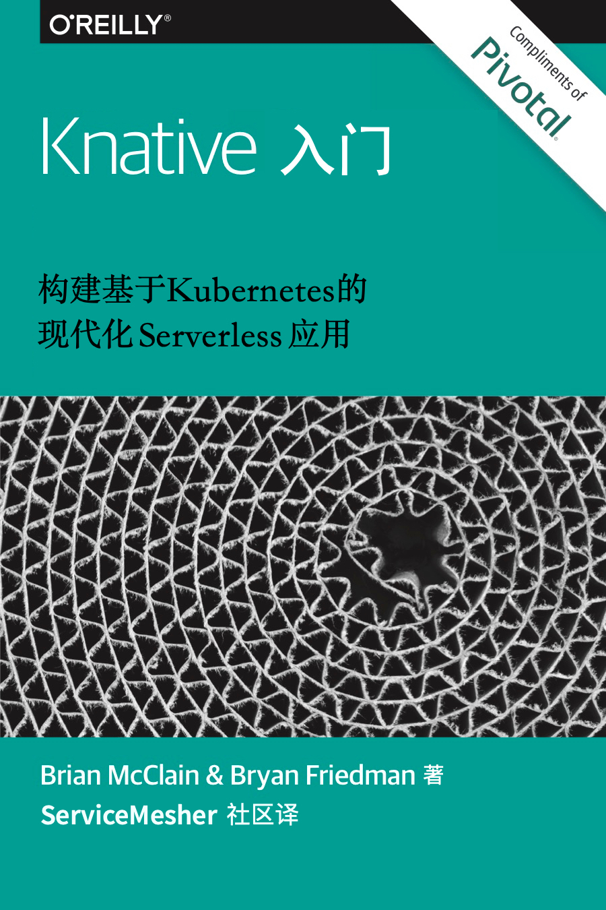

# Knative入门——构建基于 Kubernetes 的现代化Serverless应用

**本书是 Getting Started with Knative - Building Modern Serverless Workloads on Kubernetes 的中文版，由 [ServiceMesher 社区](http://www.servicemesher.com)翻译。**

## 关于本书

*Getting Started with Knative* 是一本由 Pivotal 公司赞助 O’Reilly 出品的免费电子书，英文版下载地址：<https://content.pivotal.io/ebooks/getting-started-with-knative>。

在线阅读：<http://www.servicemesher.com/getting-started-with-knative/>

Github：<https://github.com/servicemesher/getting-started-with-knative/>

## 关于 Knative

[Knative](https://github.com/knative) 是一个基于 Kubernetes 的，用于构建、部署和管理现代 serverless 应用的平台。

## 关于 ServiceMesher 社区

ServiceMesher社区，关注内容涵盖Kubernetes、Service Mesh、Istio、Serverless、Knative等云原生技术，社区分享开源技术干货，推动服务网格和云原生在企业的落地。

## 译者名单

感谢参与本书翻译和审校的所有[贡献者](https://github.com/servicemesher/getting-started-with-knative/graphs/contributors)（按字母顺序排序）：

- [SataQiu](https://github.com/SataQiu)：邱世达
- [andyyin](https://github.com/andyyin)：殷琦
- [dishuihengxin](https://github.com/dishuihengxin)：韦世滴
- [dreadbird](https://github.com/dreadbird)：王刚
- [eportzxp](https://github.com/eportzxp)：张晓鹏
- [fleeto](https://github.com/fleeto)：崔秀龙
- [haiker2011](https://github.com/haiker2011)：孙海洲
- [icyxp](https://github.com/icyxp)：徐鹏
- [jordanchenCN](https://github.com/jordanchenCN)：陈佳栋
- [junahan](https://github.com/junahan)：杨铁党
- [lou-lan](https://github.com/lou-lan)：翟怀楼
- [loverto](https://github.com/loverto)：殷龙飞
- [mathlsj](https://github.com/mathlsj)：李寿景
- [rootsongjc](https://github.com/rootsongjc)：宋净超
- [shaobai](https://github.com/shaobai)：陈冬

### 各章节详细译者信息

| 章节             | 译者   | 审校者                               |
| ---------------- | ------ | ------------------------------------ |
| 前言             | 宋净超 | 孙海洲，徐鹏                         |
| Knative 概述     | 陈佳栋 | 宋净超，孙海洲，徐鹏，邱世达，陈冬   |
| Serving（服务）  | 杨铁党 | 孙海洲，邱世达，宋净超，徐鹏         |
| Build（构建）    | 孙海洲 | 邱世达，陈冬，杨铁党，宋净超，翟怀楼 |
| Eventing（事件） | 韦世滴 | 孙海洲，邱世达，王刚，周雨青，宋净超 |
| Knative 安装     | 李寿景 | 邱世达，孙海洲，徐鹏                 |
| Knative 使用     | 殷龙飞 | 孙海洲，邱世达，王刚，宋净超         |
| 演练             | 张晓鹏 | 孙海洲，邱世达，宋净超               |
| 下一步           | 殷琦   | 邱世达，孙海洲                       |

## 反馈与参与本书

关于本书有任何问题可以[提交 Issue](https://github.com/servicemesher/getting-started-with-knative/issues/new) 反馈，参与本书翻译请参阅[规范](CODE_OF_CONDUCT.md)。

## 版权

**本书经 Pivotal 公司授权 [ServiceMesher 社区](http://www.servicemesher.com)翻译，请勿擅自印刷出版，引用本书中文版中的内容请注明出处。**

