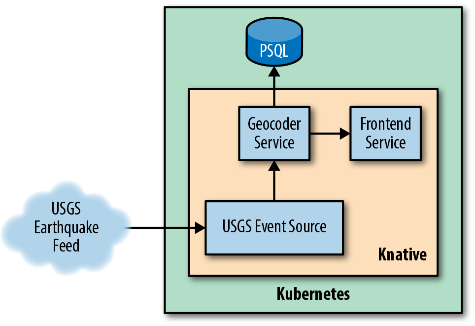
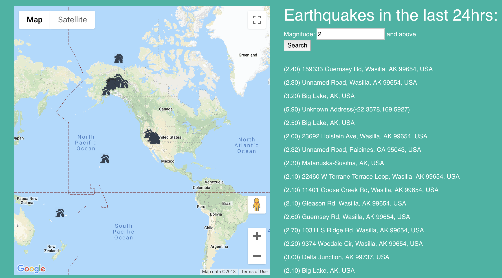

# 演练
让我们把我们所学的一切运用起来，去创造一些东西吧!我们进行一个演练，它利用了您所学到的许多知识，并通过使用[美国地质勘探局(USGS)地震数据源](https://on.doi.gov/2GmDWNB)提供了一个服务，以可视化世界各地的地震活动。您可以在 GitHub 存储库 [gswk/earthquakedemo](https://github.com/gswk/earthquake-demo) 中找到我们将要介绍的代码。
## 架构
在深入研究代码之前，让我们先看看应用程序的体系架构，如图7-1所示。我们在这里构建三个重要的东西:事件源、服务和前端。
图中Knative内部的每一个组件都代表着我们将利用目前所学的知识来构建的内容，包括使用Kaniko构建模板的服务和用于轮询数据的自定义事件源:

*USGS 事件源*
: 我们将构建一个自定义的 ContainerSource 事件源，它将在给定的时间间隔轮询USGS提供的数据。为预构建的容器映像打包。


*图 7-1 应用程序的体系结构。事件来将自于USGS的地震数据源做为我们的事件源，这将触发我们的GeoCoder服务来保存事件。我们的前台也将使用我们的Geocoder服务来查询最近的事件。*

*Geocoder 服务*
: 这将为事件源提供发布事件的端点，并使用提供的坐标查找地址。它还将为前端提供一个用来查询和检索最近的事件的端点。我们将使用构建服务来构建容器映像。与运行在Kubernetes上的Postgres数据库通信。

*前端*
: 一个可以可视化最近的地震活动的轻量级的、持续运行的前端

我们可以使用Helm在Kubernetes集群上轻松地搭建起Postgres数据库，Helm是一个可以轻松地在Kubernetes上打包和共享应用程序包的工具。关于如何在你的Kubernetes集群上启动和运行的介绍，请务必参考Helm的文档。如果您运行在Minikube或没有任何特定的权限要求的Kubernetes集群上，那么您可以使用以下简单的命令来设置Helm:
`$ helm init`

对于像谷歌的GCP这样具有更深层安全配置的集群，请参考Helm Quickstart指南。接下来我们可以设置一个Postgres数据库和传递一些配置参数以使设置更容易:
```bash
$ helm install
--name geocodedb
--set postgresqlPassword=devPass,postgresqlDatabase
            =geocode stable/postgresql
```
这将在我们的Kubernetes集群中创建一个Postgres数据库，将用户密码设置为devPass，并创建一个名为geocode的数据库。我们已经将Postgres服务器命名为geocodedb，这意味着在Kubernetes集群中，我们可以通过geocodedbpostgresql.default.svc.cluster.local访问该服务器。现在让我们来深入了解代码吧!

## Geocoder 服务
如架构图所示，我们的事件源和前端都将向Geocoder服务发送请求，后者将与Postgres数据库通信。这将我们的服务置于应用程序的中心位置。对我们服务的HTTP POST请求将会在数据库中记录事件，而GET请求将检索过去24小时内发生的事件。让我们来看一下示例7-1中我们服务的代码。
*示例 7-1 geocoder/app.rb*
```ruby
require 'geocoder'
require 'json'
require 'pg'
require 'sinatra'

set :bind, '0.0.0.0'

# DB connection credentials are passed via environment
# variables
DB_HOST = ENV["DB_HOST"] || 'localhost'
DB_DATABASE = ENV["DB_DATABASE"] || 'geocode'
DB_USER = ENV["DB_USER"] || 'postgres'
DB_PASS = ENV["DB_PASS"] || 'password'

# Connect to the database and create table if it doesn't exist
conn = PG.connect( dbname: DB_DATABASE, host: DB_HOST, 
    password: DB_PASS, user: DB_USER)
conn.exec "CREATE TABLE IF NOT EXISTS events (
    id varchar(20) NOT NULL PRIMARY KEY,
    timestamp timestamp,
    lat double precision,
    lon double precision,
    mag real,
    address text
);"

# Store an event
post '/' do
    d = JSON.parse(request.body.read.to_s)
    address = coords_to_address(d["lat"], d["long"])
    id = d["id"]
    
    conn.prepare("insert_#{id}", 
        'INSERT INTO events VALUES ($1, $2, $3, $4, $5, $6)')
    conn.exec_prepared("insert_#{id}", [d["id"], d["time"], 
        d["lat"], d["long"], d["mag"], address.to_json])
end

# Get all events from the last 24 hours
get '/' do
    select_statement = "select * from events where 
        timestamp > 'now'::timestamp - '24 hours'::interval;"
    results = conn.exec(select_statement)
    jResults = []
    results.each do |row|
        jResults << row
    end

    content_type 'application/json'
    headers 'Access-Control-Allow-Origin' => "*"
    return jResults.to_json
end

# Get the address from a given set of coordinates
def coords_to_address(lat, lon)
    coords = [lat, lon]
    results = Geocoder.search(coords)

    a = results.first
    address = {
        address: a.address,
        house_number: a.house_number,
        street: a.street,
        county: a.county,
        city: a.city,
        state: a.state,
        state_code: a.state_code,
        postal_code: a.postal_code,
        country: a.country,
        country_code: a.country_code,
        coordinates: a.coordinates
    }

    return address
end
```
我们将使用Knative为我们构建容器映像，将连接到Postgres数据库所需的信息传递给它，并运行我们的服务。我们可以在示例7-2中看到这是如何设置的。
```YAML
apiVersion: serving.knative.dev/v1alpha1
kind: Service
metadata:
  name: geocoder
  namespace: default
spec:
  runLatest:
    configuration:
      build:
        serviceAccountName: build-bot
        source:
          git:
           url: https://github.com/gswk/geocoder.git
           revision: master
        template:
          name: kaniko
          arguments:
          - name: IMAGE
            value: docker.io/gswk/geocoder
      revisionTemplate:
        spec:
          container:
            image: docker.io/gswk/geocoder
            env:
            - name: DB_HOST
              value: "geocodedb-postgresql.default.svc.cluster.local"
            - name: DB_DATABASE
              value: "geocode"
            - name: DB_USER
              value: "postgres"
            - name: DB_PASS
              value: "devPass"
```
    `kubectl apply -f earthquake-demo/geocoder-service.yaml`
因为我们已经通过环境变量传递了所有连接信息给我们的Postgres数据库，这是我们的服务运行需要的所有信息。接下来，我们将获取事件源并运行它，以便我们可以开始向新部署的服务发送事件。
# USGS 事件源
我们的事件源将负责在指定的时间间隔内轮询USGS地震活动的数据，解析它，并将其发送到我们定义的接收器。由于我们需要轮询数据，并且没有由USGS将其推送给我们的可能，因此它非常适合使用 ContainerSource 编写自定义事件源。
在设置事件源之前，还需要一个将事件发送的通道。虽然我们可以直接将事件从事件源发送到我们的服务，但如果我们希望将来能够将事件发送到另一个服务，这将给我们带来一些灵活性。我们只需要一个简单的通道，我们将在示例7-3中定义它。
```YAML
apiVersion: eventing.knative.dev/v1alpha1
kind: Channel
metadata:
  name: geocode-channel
spec:
  provisioner:
    apiVersion: eventing.knative.dev/v1alpha1
    kind: ClusterChannelProvisioner
name: in-memory-channel
```
    kubectl apply -f earthquake-demo/channel.yaml
正如我们在第6章中构建自定义事件源一样，我们的这个事件源也是由一个脚本组成，在本例中是一个Ruby脚本，它接受两个命令行标志:--sink和--interval。让我们在例7-4中看看这个。
*示例 7-4. usgs-event-source/usgs-event-source.rb*
```Ruby
require 'date'
require "httparty"
require 'json'
require 'logger'
require 'optimist'

$stdout.sync = true
@logger = Logger.new(STDOUT)
@logger.level = Logger::DEBUG

# Poll the USGS feed for real-time earthquake readings
def pull_hourly_earthquake(lastTime, sink)
    # Get all detected earthquakes in the last hour
    url = "https://earthquake.usgs.gov/earthquakes/feed/v1.0/" \
    + "summary/all_hour.geojson"
    response = HTTParty.get(url)
    j = JSON.parse(response.body)

    # Keep track of latest recorded event, reporting all
    # if none have been tracked so far
    cycleLastTime = lastTime

    # Parse each reading and emit new ones as events
    j["features"].each do |f|
        time = f["properties"]["time"]

        if time > lastTime
            msg = {
                time: DateTime.strptime(time.to_s,'%Q'),
                id: f["id"],
                mag: f["properties"]["mag"],
                lat: f["geometry"]["coordinates"][1],
                long: f["geometry"]["coordinates"][0]
            }

            publish_event(msg, sink)
        end

        # Keep track of latest reading
        if time > cycleLastTime
            cycleLastTime = time
        end
    end

    lastTime = cycleLastTime
    return lastTime
end

# POST event to provided sink
def publish_event(message, sink)
    @logger.info("Sending #{message[:id]} to #{sink}")
    puts message.to_json
    r = HTTParty.post(sink, 
        :headers => {'Content-Type'=>'text/plain'}, 
        :body => message.to_json)
    
    if r.code != 200
        @logger.error("Error! #{r}")
    end
end


# Parse CLI flags
opts = Optimist::options do
    banner <<-EOS
Poll USGS Real-Time Earthquake data
Usage:
  ruby usgs-event-source.rb
EOS
    opt :interval, "Poll Frequenvy", 
        :default => 10
    opt :sink, "Sink to send events", 
        :default => "http://localhost:8080"
end

# Begin polling USGS data
lastTime = 0
@logger.info("Polling every #{opts[:interval]} seconds")
while true do 
    @logger.debug("Polling . . .")
    lastTime = pull_hourly_earthquake(lastTime, opts[:sink])
    sleep(opts[:interval])
end
```
像往常一样，Knative在作为ContainerSource事件源运行时将处理提供--sink标志的问题。我们还提供了一个额外的标记--interval，我们将定义这个标记，因为我们编写的代码允许用户定义自己的轮询间隔。剩下的就是创建示例7-5中所示的我们的事件源的YAML，并创建订阅，以便将事件从通道发送到示例7-6中所示的服务。
*示例 7-5. earthquake-demo/usgs-event-source.yaml*
```YAML
apiVersion: sources.eventing.knative.dev/v1alpha1
kind: ContainerSource
metadata:
  labels:
    controller-tools.k8s.io: "1.0"
  name: usgs-event-source
spec:
  image: docker.io/gswk/usgs-event-source:latest
  args: 
    - "--interval=10"
  sink:
    apiVersion: serving.knative.dev/v1alpha1
    kind: Service
name: geocoder
```
    $ kubectl apply -f earthquake-demo/subscription.yaml
一旦我们应用这个YAML，事件源将启动一个持续运行的容器，该容器将轮询事件并将它们发送到我们创建的通道中。另外，我们需要将Geocoder服务连接到通道中。
*示例 7-6. earthquake-demo/subscription.yaml*
```YAML
apiVersion: eventing.knative.dev/v1alpha1
kind: Subscription
metadata:
  name: geocode-subscription
spec:
  channel:
    apiVersion: eventing.knative.dev/v1alpha1
    kind: Channel
    name: geocode-channel
  subscriber:
    ref:
      apiVersion: serving.knative.dev/v1alpha1
      kind: Service
name: geocoder
```
    $ kubectl apply -f earthquake-demo/subscription.yaml
创建了订阅之后，我们已经将所有内容连接起来，以便将事件通过自定义事件源带到环境中，然后将它们发送到服务中，服务将把它们持久化到Postgres数据库中。我们还有最后一个要部署的部分，那就是我们的前端，用来可视化所有东西。
# 前端
最后，我们需要把我们收集的所有数据一起放在前端来进行可视化。我们创建了一个简单的网站，并将其打包在一个容器中，该容器将使用Nginx提供服务。当页面加载时，它将调用Geocoder服务，返回一个地震事件的数组，包括坐标和震级，并在地图上显示它们。我们还将把它设置为Knative服务，这样我们就可以免费获得简易的路由和度量。同样，我们将像其他Knative服务一样编写一个YAML，并使用Kaniko构建模板，如示例7-7所示。
*示例 7-7. earthquake-demo/frontend/frontend-service.yaml*
```YAML

26 lines (26 sloc) 704 Bytes
apiVersion: serving.knative.dev/v1alpha1
kind: Service
metadata:
  name: earthquake-demo
  namespace: default
spec:
  runLatest:
    configuration:
      build:
        serviceAccountName: build-bot
        source:
          git:
            url: https://github.com/gswk/earthquake-demo-frontend.git
            revision: master
        template:
          name: kaniko
          arguments:
          - name: IMAGE
            value: docker.io/gswk/earthquake-demo-frontend
      revisionTemplate:
        spec:
          container:
            image: docker.io/gswk/earthquake-demo-frontend
            env:
            - name: EVENTS_API
value: "http://geocoder.default.svc.cluster.local"
```
    $ kubectl apply -f earthquake-demo/frontend-service.yaml
我们定义EVENTS_API环境变量，前端将使用该变量来了解Geocoder服务的位置。最后这一部分就绪后，我们就可以启动并运行整个系统了!我们的应用程序如图7-2所示。

*图 7-2 我们的应用程序启动起来了*
当请求进入我们的前端应用程序时，它将从Geocoder服务中提取事件，当新事件进入时，它们将被我们的自定义事件源接收。此外，Knative还提供了一些额外的工具，通过内置的日志记录、度量和跟踪功能，帮助您保持应用程序和服务的正常运行。
# 度量及日志纪录
任何在生产环境中运行过代码的人都知道我们的故事还没有结束。仅仅因为编写了代码和部署了应用程序，就需要对管理和运维负责。正确地了解代码如何处理日志及度量是该运维流程的一部分，幸运的是Knative附带了许多工具来提供这些信息。更好的是，它的大部分功能已经自动绑定到您的代码中，而不需要您做任何特殊的事情。
让我们从深入研究Geocoder服务的日志开始，这个功能由Kibana提供，Kibana是在我们设置Knative的服务组件时安装的。在我们访问任何东西之前，我们需要在我们的Kubernetes集群中设置一个代理，只需一个命令就可以轻松完成:
    `$ kubectl proxy`
这将为访问整个Kubernetes集群中打开一个代理，并可以在我们机器的8001端口上访问它。这也包括Kibana，我们可以通过http://localhost:8001/api/v1/namespaces/knative-monitoring/services/kibana-logging/proxy/app/kibana 访问它。
我们需要提供一个索引模板，现在我们可以简单地使用*和timestamp_millis的时间过滤器。